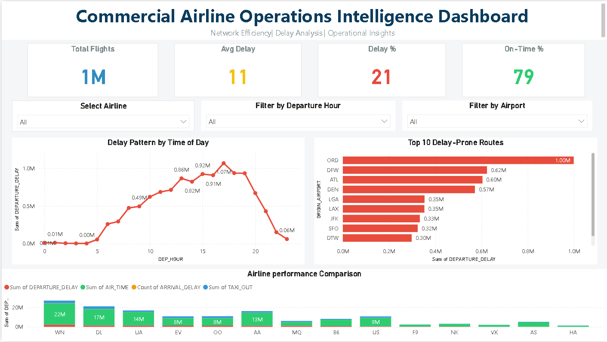

✈️ Aero Operations Intelligence Platform

🚀 Executive Overview

Aero Operations Intelligence Platform is an end-to-end, high-impact analytics solution engineered to evaluate airline operational performance, diagnose delay propagation patterns, and optimize network efficiency at scale.

This project simulates real-world airline decision-making systems by integrating data engineering, analytical modeling, and business intelligence to transform large-scale raw flight data into actionable, strategic insights.

Designed with a strong focus on operational efficiency, this platform demonstrates how airlines can leverage data to reduce delays, improve scheduling reliability, and enhance overall network performance.

---

🎯 Strategic Objectives

- Diagnose root causes of flight delays across time, routes, and aircraft rotations
- Identify structurally weak routes impacting network stability
- Quantify airline-level operational performance variations
- Detect delay propagation chains affecting downstream scheduling
- Enable data-driven operational optimization and planning

---

📊 Analytical Highlights

- Identified critical delay windows driven by operational congestion and scheduling inefficiencies
- Uncovered high-impact routes with consistent performance degradation
- Detected aircraft-level delay propagation influencing network-wide disruptions
- Evaluated airline performance variance across operational conditions and time segments

---

🛠 Technology Stack

- Python (Pandas) — Data cleaning, transformation, and feature engineering
- SQL — Advanced analytical querying and aggregation
- Power BI — Executive dashboard design and interactive visualization

---

🧱 Data Architecture

Raw Data → Data Cleaning → Feature Engineering → Analytical Modeling → Visualization Layer

---

📊 Dashboard Capabilities

- KPI-driven operational performance monitoring (Total Flights, Avg Delay, Delay Rate)
- Time-series delay pattern analysis across departure hours
- Route-level inefficiency detection and ranking
- Airline performance benchmarking and comparison
- Interactive filtering (Airline, Departure Time, Airport) for scenario-based analysis

---

💡 Business Impact

This platform demonstrates how advanced analytics can be leveraged to enhance airline operational efficiency by identifying delay bottlenecks, improving turnaround planning, and optimizing route-level performance.

The insights generated can support real-world decision-making in areas such as network planning, scheduling optimization, and operational risk mitigation.

---

📷 Dashboard Preview

---

📂 Repository Structure

aero-operations-intelligence-platform/
│
├── data/
│   ├── processed/
│   │   ├── flights_cleaned.csv
│   │   ├── aircraft_analysis.csv
│   │   ├── route_analysis.csv
│
├── python/
│   ├── data_cleaning.py
│   ├── advanced_analysis.py
│
├── sql/
│   ├── analysis.sql
│
├── dashboard/
│   ├── airline_operations_delay_dashboard.pbix
│   ├── dashboard_preview.png
│
├── README.md

---

🧠 Key Learnings

- Handling and analyzing large-scale datasets (1M+ records)
- Building end-to-end data analytics pipelines
- Translating raw operational data into actionable business insights
- Designing executive-level dashboards for decision-making
- Applying analytical thinking to real-world operational challenges

---

🔮 Future Enhancements

- Predictive delay modeling using machine learning techniques
- Real-time data integration for live operational monitoring
- Advanced route and schedule optimization models

---

🚀 Project Significance

This project reflects a strong foundation in data analytics by combining technical implementation with business understanding. It highlights the ability to move beyond basic reporting and build structured, insight-driven solutions aligned with real-world operational problems.

---

📌 Note

This project is built using publicly available airline datasets. The analytical patterns and operational insights derived are applicable to real-world airline environments and can be extended to commercial airline operations.
